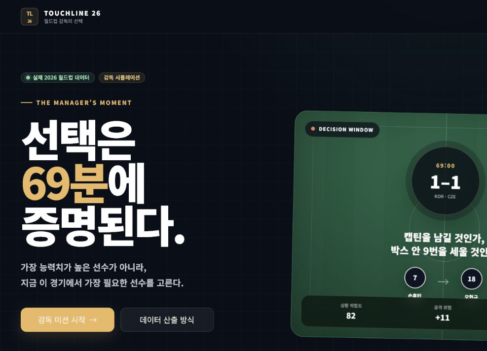

# 월드컵 감독의 선택: TOUCHLINE 26

> 가장 능력치가 높은 선수가 아니라, 지금 이 경기에서 가장 필요한 선수를 고른다.

실제 2026 월드컵의 결정적인 순간으로 돌아가 교체 선수, 역할, 팀 지시를 직접 선택하고 데이터 기반 결과 리포트를 받는 회고형 전술 의사결정 웹서비스입니다.



## 프로젝트 목적

정적인 전술 이미지가 아니라 사용자가 실제로 감독의 판단 과정을 플레이하도록 설계했습니다. 경기 상태를 읽고, 필드와 벤치를 비교하고, 드래그 또는 클릭으로 교체하고, 역할과 팀 지시를 결정한 뒤 선택의 장점·위험·보완책·실제 감독 선택과의 차이를 확인합니다.

이 서비스는 실제 스코어를 예측하거나 선수의 절대 능력을 평가하지 않습니다.

## 주요 기능

- 시작 화면 → 경기 선택 → 미션 브리핑 → 전술 보드 → 결과 분석의 완전한 흐름
- 실제 2026 월드컵 대한민국 2–1 체코 경기 데이터
- 69분 동점 상황과 84분 리드 보호 상황의 두 개 미션
- 필드 선수 클릭 또는 벤치 선수 드래그앤드롭 교체
- 모바일에서도 동등하게 작동하는 클릭 기반 OUT/IN 선택
- 선수별 1–20 회고형 퍼포먼스 스탯과 표본 시간·신뢰도
- 포지션에 따라 제한되는 11개 역할
- 공격 방향·압박·수비 라인·공격 성향 팀 지시
- 공격 위협·점유 안정·압박 강도·수비 안정 영향 게이지
- 60/20/10/10 가중치 기반 상황 적합도와 선언형 위험 패널티
- 장점, 위험, 추천 보완책, 대안 선수, 실제 감독 선택 비교
- 실제 사실·앱 파생값·전술적 추론의 명시적 구분
- 손상된 localStorage와 직접 결과 URL 접근의 안전한 복구
- 잘못된 경기·미션 URL의 사용자 친화적 오류 화면

## 사용자 흐름

1. `/`에서 제품 목적과 실제 데이터 사용 여부 확인
2. `/matches`에서 검증된 실제 경기 선택
3. 경기 안에서 69분 또는 84분 미션 선택
4. 브리핑에서 스코어, 상대 형태, 직전 이벤트 확인
5. 전술 보드에서 OUT 선수와 IN 선수 선택
6. 선수 1–20 지표와 차이 비교
7. 투입 역할과 네 종류의 팀 지시 선택
8. 적합도·영향 게이지·위험 경고의 실시간 변화 확인
9. 결정 확정 후 결과 리포트와 실제 감독 선택 비교
10. 재도전 또는 다음 미션 진행

## 기술 스택

- Next.js 16.2.12 App Router
- React 19.2.4
- TypeScript strict mode
- Tailwind CSS 4
- dnd-kit
- Vitest + Testing Library + jsdom
- 정적 JSON 데이터
- localStorage: 확정된 사용자 선택 기록에만 사용
- Vercel 배포 기준

## 로컬 실행

Node.js 24.x와 npm 11을 기준으로 검증했습니다.

```bash
npm install
npm run dev
```

브라우저에서 `http://localhost:3000`을 엽니다.

환경변수, 외부 API 키, 데이터베이스는 필요하지 않습니다.

## 검증과 빌드

```bash
npm run lint
npm run test
npm run build
npm run start
```

테스트 범위:

- 백분위와 1–20 변환
- per90 정규화와 신뢰도 수축
- 18명 × 8개 저장 능력치의 원자료 기반 완전 재현
- 포지션 그룹 밖 선수가 비교 표본에 섞이지 않는지 검증
- NaN·Infinity·점수 범위 방어
- 상황 적합도 60/20/10/10 계산
- 선언형 위험 규칙
- 네 개 영향 게이지와 전후 차이
- 규칙 기반 결과 설명
- localStorage 저장·손상 복구
- 클릭 기반 OUT/IN → 역할 → 팀 지시 → 결과 이동 통합 흐름

## Vercel 배포

### 대시보드

1. 이 저장소를 GitHub 공개 저장소로 push합니다.
2. Vercel의 **Add New → Project**에서 저장소를 Import합니다.
3. Framework Preset은 Next.js, Root Directory는 저장소 루트로 둡니다.
4. 환경변수 없이 Deploy합니다.
5. 생성된 URL을 새 시크릿 창과 모바일 폭에서 확인합니다.

### CLI

```bash
npx vercel
npx vercel --prod
```

`vercel.json`은 Next.js 프레임워크를 명시합니다. 로그인·결제·API 키는 서비스 사용에 필요하지 않습니다.

## 디렉터리 구조

```text
src/
  app/
    matches/[matchId]/scenarios/[scenarioId]/
      briefing/
      tactics/
      result/
    about-data/
  components/
    common/
    layout/
    match/
    tactics/
    result/
  data/
    matches/
    players/
    scenarios/
    roles/
    instructions/
    copy/
  lib/
    attributes/
    scoring/
    decision/
docs/
  COMPETITION_REQUIREMENTS.md
  IMPLEMENTATION_PLAN.md
  DATA_RESEARCH.md
  DEMO_SCRIPT.md
  FINAL_SUBMISSION_CHECKLIST.md
```

## 데이터 구조

### 경기

경기 메타데이터, 팀, 최종 스코어, 공식 포메이션, 선발·벤치, 실제 이벤트, 출처 메타데이터를 보관합니다.

### 선수

공식 이름·등번호·포지션, 전술상 포지션 그룹, 출전 시간, 원자료, 1–20 파생 지표, 신뢰도, 계산 맥락, 출처 상태를 보관합니다.

### 미션

결정 시점, 당시 스코어, 미션, 상대 형태, 직전 흐름, 현재 라인업, 벤치 후보, 능력치 가중치, 기본 팀 지시, 위험 규칙, 실제 교체를 보관합니다.

## 사용한 실제 경기

- 대회: FIFA World Cup 2026
- 경기: 대한민국 2–1 체코
- 일시: 2026-06-11 20:00 현지
- 단계: A조 조별리그 Match 2
- 장소: Guadalajara Stadium, Guadalajara, Mexico
- 전반: 0–0
- 실제 교체:
  - 62′ 황희찬 IN / 이재성 OUT
  - 69′ 엄지성 IN / 이태석 OUT
  - 69′ 오현규 IN / 손흥민 OUT
  - 84′ 김진규 IN / 황인범 OUT
  - 84′ 박진섭 IN / 백승호 OUT

## 데이터 출처

- [FIFA Full-Time Match Report](https://fdp.fifa.org/assetspublic/ce281/r12450/pdf/FullTimeMatchReport-English.pdf): 경기, 명단, 득점, 도움, 교체, 공식 최종 통계
- [FIFA Tactical Line-up](https://fdp.fifa.org/assetspublic/ce281/r12450/pdf/TacticalLineup-English.pdf): 대한민국 3-4-3, 체코 5-2-3과 선발 위치
- [FIFA Post-Match Summary Report](https://www.fifatrainingcentre.com/media/native/tournaments/fifa-world-cup/2026/PMSR-M02%20KOR%20V%20CZE%20.pdf): 선수별 패스·라인브레이크·압박·슈팅 등
- [AP Match Report](https://apnews.com/article/world-cup-south-korea-czech-republic-score-496e7772dde95ca0af90b5074fdb13d9): 경기 흐름과 독립 교차 확인
- [OpenFootball World Cup JSON](https://github.com/openfootball/worldcup.json): CC0 경기 메타데이터

확인일: 2026-07-27.

FIFA 리포트는 사실 확인을 위한 로컬 연구 자료로만 내려받았고 저장소에는 포함하지 않습니다. 공식 로고·엠블럼·PDF 캡처·표 디자인은 앱에 사용하지 않습니다.

## 1–20 능력치 산출

1. 공식 리포트의 패스, 라인브레이크, 볼 전진, 테이크온, 슈팅, 득점, 압박 등 사용 가능한 원자료를 정리합니다.
2. 횟수형 지표는 가능한 경우 90분당 값으로 변환합니다.
3. `players.json`에서 GK, CB, FB/WB, DM, CM/AM, WINGER, STRIKER 포지션 그룹별 비교 표본을 자동 구성합니다.
4. 그룹 내 백분위를 `round(1 + 19 × percentile)`로 1–20에 매핑합니다.
5. 짧은 출전·낮은 커버리지는 `confidence × rawScore + (1-confidence) × 10.5`로 중앙값에 수축합니다.
6. 결과를 1–20으로 제한하고 표본 시간·높음/보통/낮음 신뢰도를 함께 표시합니다.

이 수치는 FIFA 공식 평점, Football Manager 능력치, 선수의 커리어 절대 평가가 아닙니다. 한 경기의 종료 후 관측값을 UI에서 비교하기 위한 앱 자체 회고 지표입니다.

미출전 선수는 실제 경기 퍼포먼스를 만들지 않고 `rawMetrics: null`, 낮은 신뢰도, 중립 기준을 사용합니다. 출처에 선수별 공중볼 지표가 없으므로 공중볼 능력치도 추정하지 않고 중립 처리합니다.

저장값은 다음 명령으로 원자료부터 전부 다시 계산해 검증할 수 있습니다.

```bash
npm run attributes:verify
npm run attributes:verify -- --explain=oh-hyeongyu
```

정확한 지표 정의, 7개 포지션 그룹별 가중치, 비교 표본 구성과 한계는 [`docs/ATTRIBUTE_PIPELINE.md`](docs/ATTRIBUTE_PIPELINE.md)에 공개했습니다.

## 상황 적합도

```text
상황 적합도 =
  선수 능력치 적합도 60%
+ 역할 적합도 20%
+ 체력·신선도 10%
+ 상대 전술 매치업 10%
- 위험 패널티
```

미션별 능력치 가중치는 JSON에서 관리합니다. 포지션 재배치, 높은 라인+낮은 압박, 수동적 저블록, 리드 상황의 과도한 공격 성향, 낮은 데이터 신뢰도는 선언형 규칙으로 패널티를 적용합니다. 결과는 0–100으로 제한합니다.

## 샘플 데이터 구분

대표 경기와 두 미션은 모두 `isSample: false`인 실제 경기 기반 데이터입니다. 미출전 선수의 중립값은 샘플 경기 데이터가 아니라 “관측 표본 없음” 상태이며 화면에 낮은 신뢰도와 데이터 제한을 표시합니다. 실제 사실과 앱 파생값은 필드와 설명 문구로 구분합니다.

## 외부 자산과 라이선스

- 외부 이미지·선수 사진·팀 엠블럼·FIFA 공식 그래픽: 사용하지 않음
- 축구장·선수 토큰·게이지: HTML/CSS로 자체 제작
- 글꼴: 시스템 글꼴 스택, 별도 다운로드 없음
- dnd-kit: MIT
- Next.js/React/Tailwind/Vitest/Testing Library: 각 프로젝트의 오픈소스 라이선스 적용
- OpenFootball 경기 메타데이터: CC0/Public Domain

이 프로젝트는 FIFA, 대한민국 축구대표팀, 체코 축구대표팀, 선수와 제휴하지 않은 비공식·비상업적 프로젝트입니다.

## 접근성

- 시맨틱 헤딩·목록·표·필드셋
- 본문 바로가기
- 명확한 버튼 텍스트와 포커스 링
- dnd-kit 키보드 센서
- 드래그와 동등한 클릭 교체 방식
- `aria-label`, `aria-pressed`, `aria-live`
- 색상 외에 OUT/IN, 위험, 텍스트 라벨 병행
- `prefers-reduced-motion` 반영
- 모바일 가로 스크롤 방지

## 한계

- 선수 지표는 한 경기 종료 후 자료라 69분 당시의 실시간 예측값이 아닙니다.
- 단일 경기·짧은 출전 표본이므로 신뢰구간을 대신해 보수적 수축과 신뢰도 라벨을 사용합니다.
- `fitness`는 미션 계산을 위한 보수적인 시뮬레이션 입력이며 공식 생체 데이터가 아닙니다.
- 세부 역할과 교체 의도는 공식 설명이 없을 때 전술적 추론입니다.
- 경기 종료 후 발생한 득점과 교체의 인과관계를 단정하지 않습니다.
- 84분 장면의 세부 포지션은 공식 이벤트와 시작 전술을 바탕으로 한 분석적 재구성입니다.

## 향후 개선

- 공식 타임슬라이스 데이터가 확보되면 의사결정 시점 이전 정보만 사용하는 모드 추가
- 두 번째 실제 경기 추가
- 포지션 비교 표본 확대와 신뢰구간 시각화
- 키보드 전술 보드 조작 설명 강화
- 익명·집계형 사용자 선택 통계
- 공유용 결과 카드

## 대회 제출 체크리스트

- [ ] 공개 Vercel URL
- [ ] 공개 GitHub 저장소
- [ ] 90초–2분 YouTube 시연 영상
- [ ] 새 시크릿 창·주요 브라우저·모바일 확인
- [ ] 데이터 출처와 라이선스 확인
- [ ] 콘솔 오류 없음
- [ ] `npm run lint`, `npm run test`, `npm run build` 성공
- [ ] 최종 제출 시각과 시간대 재확인
- [ ] 2026-08-03 10:00 이후 GitHub 커밋 금지

세부 항목은 [`docs/FINAL_SUBMISSION_CHECKLIST.md`](docs/FINAL_SUBMISSION_CHECKLIST.md)를 따릅니다.
